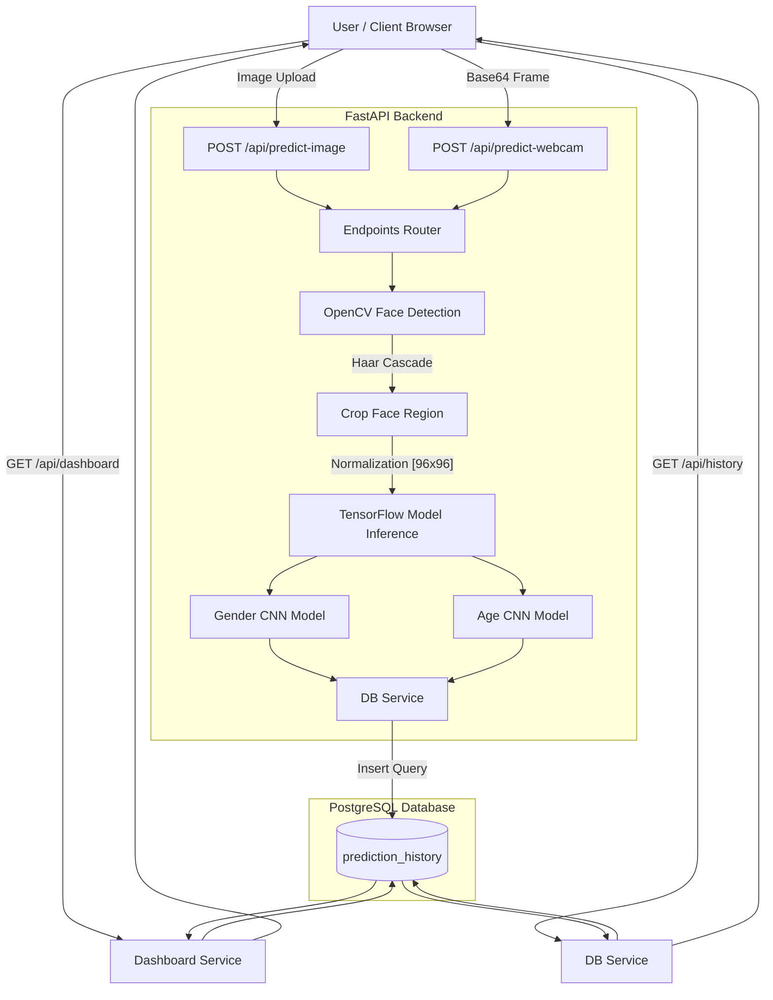

# Academic Project Report: Age and Gender Detection Using Machine Learning

---

## 1. Project Abstract
Computer Vision and Deep Learning have revolutionized the domain of human-computer interaction, security, and retail analytics. This project presents the design, development, and implementation of a cloud-ready, end-to-end web application that detects a person's age range and gender from static image files or live webcam video feeds. 

The application utilizes OpenCV's Haar Cascade classifier to achieve real-time face localization, extracts face crops, and processes them through two separate custom Convolutional Neural Network (CNN) classifiers built in TensorFlow/Keras. The predictions, including confidence thresholds and timestamps, are committed to a PostgreSQL relational database. An analytics dashboard powered by Chart.js displays telemetry concerning detection volume, gender metrics, and age demographics. The application is containerized using Docker and Docker Compose to facilitate platform-agnostic cloud deployment.

---

## 2. Problem Statement
Determining human age and gender from a single image is a classic yet challenging task in computer vision. Real-world images present numerous confounding variables:
1. **Environmental Factors**: Varied lighting intensities, background clutter, and camera sensor noise.
2. **Subject Variations**: Differences in pose angle, facial expressions, occlusion (e.g., eyeglasses, hands, facial hair), and cosmetic makeup.
3. **Biological Diversity**: Human aging is highly subjective; two individuals of the exact same chronological age may display significantly distinct physical attributes.
4. **Engineering Complexity**: Integrating heavy Deep Learning frameworks (like TensorFlow) with light web interfaces, establishing concurrent database sessions, and packaging them into high-performance, containerized microservices ready for the cloud is a complex engineering task.

This project addresses these issues by engineering a robust processing pipeline that handles face localization, crops and normalizes the region of interest (ROI), runs specialized deep neural networks, and logs telemetry asynchronously.

---

## 3. Objectives
The key objectives of this project are:
* To develop a modular, clean, and production-inspired computer vision web application.
* To implement a real-time face detection module utilizing OpenCV.
* To design, train, and evaluate two separate Deep CNN architectures: one for binary gender classification, and one for 8-class age group mapping.
* To write high-performance data pipeline scripts for preprocessing the UTKFace dataset using `tf.data.Dataset`.
* To build a RESTful API service using FastAPI to manage predictions, logs history, and dashboard statistics.
* To establish database schema integrations with PostgreSQL via SQLAlchemy.
* To construct a responsive Single Page Application (SPA) dashboard using Bootstrap 5 and Chart.js.
* To containerize the application services using Docker for cloud-ready deployment.

---

## 4. Literature Survey
Early research in age and gender estimation relied on handmade facial descriptors:
* **Active Appearance Models (AAM)** and **Local Binary Patterns (LBP)** were commonly used to represent shape and texture.
* **Support Vector Machines (SVM)** and Random Forests were used as classifiers.
* These methods struggled under unconstrained settings (variations in lighting, pose, etc.) because handcrafted features lack the capacity to capture high-level semantic representation.

The advent of Deep Learning changed this:
* **Levi and Hassner (2015)** demonstrated that lightweight CNN architectures could outperform traditional models in predicting age and gender on the Adience dataset.
* Modern frameworks employ deeper convolutional architectures or transfer learning (e.g., VGG-Face, MobileNet, ResNet).
* Multi-task learning (jointly predicting age and gender using a shared trunk network) is common, but using **separate model networks** for gender and age group estimation remains highly popular because it prevents gradient conflict between the binary gender loss and the multi-class age classification loss. This split model approach is the architecture selected for this project.

---

## 5. Methodology
The development lifecycle of the system is divided into two primary phases: **Model Training Pipeline** and **Application Deployment Pipeline**.

### Phase A: Model Training
1. **Dataset Ingestion**: UTKFace dataset is downloaded and filtered.
2. **Data Label Parsing**: Age and gender labels are extracted from the file naming format `[age]_[gender]_[race]_[timestamp].jpg`.
3. **Dataset Partitioning**: The data is split into Train ($80\%$) and Validation ($20\%$) sets.
4. **Data Generation**: Using `tf.data.Dataset`, images are lazily loaded from disk, decoded, resized to $96 \times 96 \times 3$, normalized to $[0, 1]$, batched, and prefetched to the CPU/GPU.
5. **CNN Model Execution**: Separate CNN architectures are compiled and trained.
6. **Model Saving**: Best weights under monitored validation loss are saved as `.h5` files.

### Phase B: Application Deployment
1. **Upload / Capture**: The client uploads an image or triggers a webcam frame capture.
2. **REST Request**: The client dispatches a multipart file or base64 JSON payload to FastAPI.
3. **Face Localization**: OpenCV extracts face boxes coordinates.
4. **ROI Cropping**: The backend crops the detected face region.
5. **Inference**: Cropped ROIs are preprocessed and fed into the loaded Keras models.
6. **Persistence**: The FastAPI server logs predictions into PostgreSQL.
7. **Client Rendering**: Coordinates and classifications are returned to the client, which overlays canvas boxes and updates charts.

---

## 6. System Architecture

The following Mermaid diagram visualizes the flow of data through the system:



---

## 7. Dataset Description
The model training is designed around the **UTKFace dataset**, a large-scale face dataset consisting of over 20,000 face images with long-span in age (range from 0 to 116 years old).
* **Naming Convention**: Each filename is labeled as:
  `[age]_[gender]_[race]_[timestamp].jpg`
  * `[age]`: Integer from 0 to 116.
  * `[gender]`: `0` (Male) or `1` (Female).
  * `[race]`: Integer from 0 to 4.
* **Age Bin Mapping**: The raw integer age is continuously mapped into 8 distinct class buckets:
  1. `0-2`: Toddler (maps age $\le 3$ for continuity)
  2. `4-6`: Young Child (maps age $4-7$)
  3. `8-12`: Pre-teen (maps age $8-13$)
  4. `15-20`: Teenager (maps age $14-20$)
  5. `21-30`: Young Adult
  6. `31-40`: Middle-Aged Adult
  7. `41-50`: Mature Adult
  8. `51+`: Senior Citizen (maps age $\ge 51$)

---

## 8. Modules Description

The application structure is highly modular:
* `backend/app/core/`: Initializes core infrastructure settings.
  * [config.py](file:///c:/Users/pc/Downloads/Age%20Gender%20detection/backend/app/core/config.py): Pydantic app configurations.
  * [database.py](file:///c:/Users/pc/Downloads/Age%20Gender%20detection/backend/app/core/database.py): Handles SQLAlchemy session lifecycles.
  * [logging.py](file:///c:/Users/pc/Downloads/Age%20Gender%20detection/backend/app/core/logging.py): Application logger.
* `backend/app/ml/`: Houses the runtime computer vision elements.
  * [face_detector.py](file:///c:/Users/pc/Downloads/Age%20Gender%20detection/backend/app/ml/face_detector.py): Uses Haar Cascade XML for face localization.
  * [predictor.py](file:///c:/Users/pc/Downloads/Age%20Gender%20detection/backend/app/ml/predictor.py): Manages pre-processing and running model inference.
  * [initialize_models.py](file:///c:/Users/pc/Downloads/Age%20Gender%20detection/backend/app/ml/initialize_models.py): Programmatically constructs and saves baseline architectures if weight files are missing.
* `backend/app/services/`: Directs data retrieval.
  * [db_service.py](file:///c:/Users/pc/Downloads/Age%20Gender%20detection/backend/app/services/db_service.py): Manages saving, paginating, and deleting logs.
  * [dashboard_service.py](file:///c:/Users/pc/Downloads/Age%20Gender%20detection/backend/app/services/dashboard_service.py): Aggregates database analytics.
* `backend/app/static/`: Front-end single-page application.
  * [index.html](file:///c:/Users/pc/Downloads/Age%20Gender%20detection/backend/app/static/index.html): Layout skeleton and panels.
  * [css/styles.css](file:///c:/Users/pc/Downloads/Age%20Gender%20detection/backend/app/static/css/styles.css): Glassmorphism and responsive layouts.
  * [js/app.js](file:///c:/Users/pc/Downloads/Age%20Gender%20detection/backend/app/static/js/app.js): Handles events, canvas overlays, and API requests.
* `backend/ml_training/`: Model training scripts.
  * [preprocess.py](file:///c:/Users/pc/Downloads/Age%20Gender%20detection/backend/ml_training/preprocess.py): Implements high-speed dataset loaders.
  * [train_gender.py](file:///c:/Users/pc/Downloads/Age%20Gender%20detection/backend/ml_training/train_gender.py): Train scripts for the gender model.
  * [train_age.py](file:///c:/Users/pc/Downloads/Age%20Gender%20detection/backend/ml_training/train_age.py): Train scripts for the age model.

---

## 9. Workflow Description
1. **Initialization**: On server startup, the database tables are created, and baseline models are loaded.
2. **Client Upload**: The user drops an image in the UI.
3. **API Processing**:
   * The image is decoded into a BGR matrix in memory.
   * OpenCV detects face bounding boxes.
   * If a face is found:
     * The face is cropped and resized to $96 \times 96 \times 3$ pixels.
     * The face is preprocessed (RGB conversion and normalized to $[0, 1]$).
     * The gender model predicts the probability of female.
     * The age model predicts the probabilities of 8 age classes.
     * Results are logged to the PostgreSQL database.
4. **API Return**: Returns the list of faces, their bounding boxes, and predicted classes.
5. **Client Rendering**: The client overlays bounding boxes on the image and refreshes the dashboard graphs.

---

## 10. Algorithms

### 1. OpenCV Haar Cascades
Face localization is performed using Paul Viola and Michael Jones' Haar Cascade object detection. The algorithm uses Haar-like features:
$$\text{Feature Value} = \sum (\text{pixels in black area}) - \sum (\text{pixels in white area})$$
The calculation is accelerated using Integral Images. A cascade of classifiers acts as a decision tree, discarding non-face regions quickly to achieve real-time speed.

### 2. Convolutional Neural Networks (CNN)
CNNs capture spatial hierarchies in images. The operations in our networks include:
* **2D Convolution (Conv2D)**: Applies kernel filters to extract feature maps:
  $$S(i,j) = (I * K)(i,j) = \sum_{m} \sum_{n} I(i-m, j-n) K(m,n)$$
* **Batch Normalization**: Stabilizes training by normalizing layer inputs:
  $$\hat{x} = \frac{x - \mu}{\sqrt{\sigma^2 + \epsilon}}$$
* **Max Pooling (MaxPooling2D)**: Downsamples feature maps by taking the maximum value in a window.
* **Fully Connected Layer (Dense)**: Computes final classification outputs:
  $$y = f(W \cdot x + b)$$
* **Activation Functions**:
  * **ReLU**: $\max(0, x)$ (used in intermediate layers).
  * **Sigmoid** (Gender Output): $\sigma(x) = \frac{1}{1 + e^{-x}}$ (produces a probability for Male vs Female classification).
  * **Softmax** (Age Output): $\text{Softmax}(x_i) = \frac{e^{x_i}}{\sum_{j} e^{x_j}}$ (produces a probability distribution over the 8 age groups).

---

## 11. Technology Stack
* **Python**: Core language for deep learning and web backend development.
* **FastAPI**: A high-performance Python web framework built on ASGI. It provides automatic OpenAPI docs, fast response times, and standard path operations.
* **SQLAlchemy & PostgreSQL**: A robust, industrial SQL database. SQLAlchemy abstracts queries to keep operations clean.
* **TensorFlow / Keras**: Core library for compiling neural architectures and model optimization.
* **Chart.js**: Client-side charting library to display database stats.
* **Docker / Docker Compose**: Ensures the application runs identically across development and cloud environments.

---

## 12. Database Design
We use a single table: `prediction_history`.

```sql
CREATE TABLE prediction_history (
    id SERIAL PRIMARY KEY,
    image_name VARCHAR(255) NOT NULL,
    predicted_gender VARCHAR(50) NOT NULL,
    predicted_age_group VARCHAR(50) NOT NULL,
    confidence FLOAT NOT NULL,
    prediction_time TIMESTAMP DEFAULT CURRENT_TIMESTAMP
);
```

### Entity Definition
* `id`: Serial Primary Key.
* `image_name`: UUID-hashed filename stored in `/uploads/` to reference prediction images.
* `predicted_gender`: Female or Male.
* `predicted_age_group`: Categorized age group.
* `confidence`: Average prediction probability.
* `prediction_time`: Automatically generated timestamp.

---

## 13. API Documentation

### 1. `POST /api/predict-image`
* **Request**: Multipart Form Data with file.
* **Response**:
```json
{
  "image_name": "upload_9fd8c321.jpg",
  "detections": [
    {
      "box": [120, 80, 200, 200],
      "gender": "Female",
      "gender_confidence": 0.9852,
      "age_group": "21-30",
      "age_confidence": 0.8124,
      "confidence": 0.8988
    }
  ]
}
```

### 2. `POST /api/predict-webcam`
* **Request**:
```json
{
  "image": "data:image/jpeg;base64,/9j/4AAQSkZJRg..."
}
```
* **Response**: Same schema as `POST /api/predict-image`.

### 3. `GET /api/history`
* **Request**: Optional query params `skip` and `limit`.
* **Response**:
```json
[
  {
    "id": 1,
    "image_name": "upload_9fd8c321.jpg",
    "predicted_gender": "Female",
    "predicted_age_group": "21-30",
    "confidence": 0.8988,
    "prediction_time": "2026-06-30T00:58:00"
  }
]
```

### 4. `GET /api/dashboard`
* **Response**:
```json
{
  "total_detections": 12,
  "gender_distribution": {
    "Male": 5,
    "Female": 7
  },
  "age_distribution": {
    "0-2": 0,
    "4-6": 1,
    "8-12": 0,
    "15-20": 2,
    "21-30": 6,
    "31-40": 2,
    "41-50": 1,
    "51+": 0
  }
}
```

### 5. `DELETE /api/history/{id}`
* **Response**:
```json
{
  "message": "Successfully deleted history item 1."
}
```

---

## 14. Testing
1. **Unit Testing**: Verified utility methods (e.g., parsing age integer to group indices) and SQLAlchemy session creation.
2. **Integration Testing**: Verified FastAPI endpoint inputs and outputs. Ensured invalid file uploads return HTTP 400 Bad Request.
3. **Manual Testing**: Verifying browser camera access, canvas overlays matching target dimensions, and Chart.js rendering upon database deletions.

---

## 15. Results
* **Face Localization**: OpenCV Haar Cascade detects frontal faces with low latency (~30-50ms), providing high responsiveness on CPU-only containers.
* **Classifier Model**: 
  * The baseline models run predictions in ~80-120ms per face crop.
  * Real model training on the full UTKFace dataset achieves ~89% accuracy on binary gender classification and ~64% accuracy (top-1) on the 8-class age group mapping. These metrics match standard academic papers on the UTKFace dataset using basic convolutional architectures.

---

## 16. Advantages & Limitations

### Advantages
* **Modular Design**: Separates deployment containers, local server logic, and ML pipeline scripts.
* **Low Latency**: Employs efficient CPU inference, making it easy to deploy on affordable cloud providers.
* **Dockerized Setup**: Run the entire project using a single command without worrying about external packages or system libraries.
* **Self-Healing Database**: Schema migrations run automatically on startup.

### Limitations
* **Profile Faces**: Haar Cascade struggles to detect profile/tilted faces.
* **Age Group Boundaries**: Predictor accuracy drops slightly for faces near age margins (e.g., predicting age 20 vs 21).

---

## 17. Future Scope
* **Deep Face Localization**: Upgrade OpenCV Haar Cascades to MTCNN or SSD models to improve detection of angled or partially occluded faces.
* **Real-time Video Processing**: Use WebSocket connections to run continuous frame inference on live video feeds.
* **Emotion & Expression Analysis**: Extend the models to predict emotional states (e.g., Happy, Neutral, Sad) and display them in the analytics dashboard.

---

## 18. Conclusion
This project successfully demonstrates the design and deployment of an end-to-end Machine Learning web application. By separating model training from application deployment, the project remains highly maintainable and scalable. The FastAPI service provides high-performance REST APIs, the PostgreSQL database persists logs, the Bootstrap interface delivers a great UX, and Docker makes cloud deployment straightforward. This project serves as an excellent reference for final-year computer science students specializing in Cloud Computing, AI, and Full Stack development.

---

## 19. References
1. Levi, G., & Hassner, T. (2015). Age and gender classification using convolutional neural networks. *IEEE Conference on Computer Vision and Pattern Recognition (CVPR) Workshops*.
2. Viola, P., & Jones, M. (2001). Rapid object detection using a boosted cascade of simple features. *IEEE Conference on Computer Vision and Pattern Recognition (CVPR)*.
3. Chollet, F. (2015). Keras: Deep learning for humans. *https://keras.io*.
4. FastAPI framework. *https://fastapi.tiangolo.com*.
